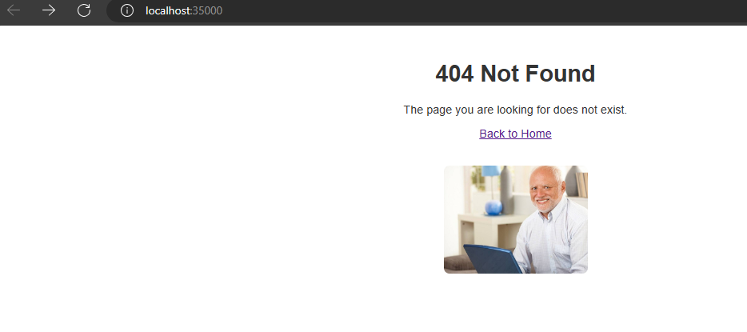
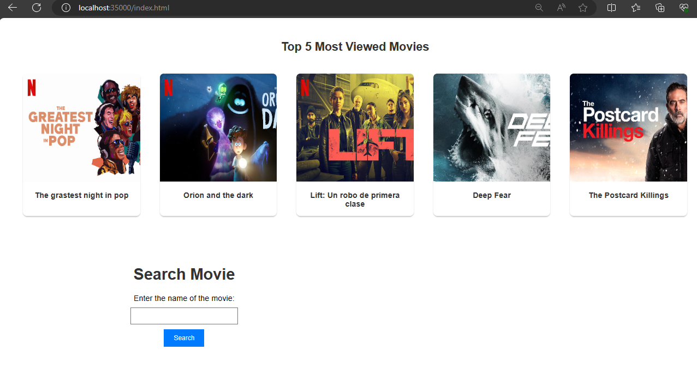
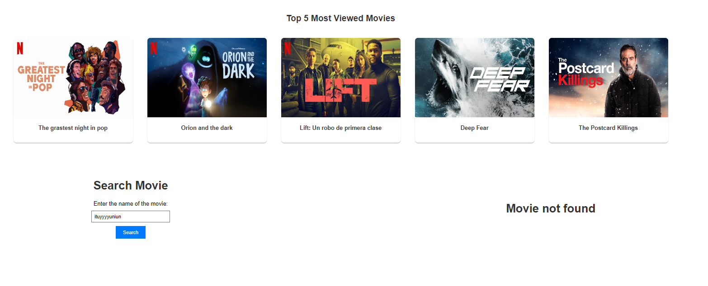

# Taller 4: Servidores de aplicaciones, meta protocolos de objetos, patrón IOC, reflexión

Para este taller se debe construir un servidor Web (tipo Apache) en Java. El servidor debe ser capaz de entregar páginas html e imágenes tipo PNG. Igualmente el servidor debe proveer un framework IoC para la construcción de aplicaciones web a partir de POJOS. Usando el servidor se debe construir una aplicación Web de ejemplo. El servidor debe atender múltiples solicitudes no concurrentes.

Para este taller desarrolle un prototipo mínimo que demuestre capcidades reflexivas de JAVA y permita por lo menos cargar un bean (POJO) y derivar una aplicación Web a partir de él. 

Se ha construido una aplicación para consultar la información de películas de cine. La aplicación recibirá una frase de búsqueda del título, por ejemplo “Guardians of the galaxy” y deberá mostrar los datos de la película correspondiente. El servidor lee los archivos del disco local y retornar todos los archivos solicitados, incluyendo páginas html, archivos java script, css e imágenes.

Para lo anterior, se utilaza el API gratuito de [OMBd](https://www.omdbapi.com/).

## Iniciando

Estas instrucciones le permitirán obtener una copia del proyecto en funcionamiento en su máquina local para fines de desarrollo y prueba.

### Prerequisitos

Qué cosas se necesitan para ejecutar el software.

* Git
* Maven
* Java

### Instalación	y ejecución

A continuación se presentan los pasos para obtener una copia del proyecto en funcionamiento en su máquina local.

* Clonar el proyecto
    ```bash
    git clone https://github.com/An6ie02/AREP-TALLER-04.git
    cd AREP-TALLER-04
    ```
* Compilar el proyecto
    ```bash
    mvn compile
    mvn package
    ```
* Ejecutar el proyecto
    ```bash
    java -cp target\reflexion-app-1.0-SNAPSHOT-jar-with-dependencies.jar edu.escuelaing.arep.reflexion.App
    ```
* Diríjase a su navegador de preferencia y vaya a la siguiente dirección: [Página principal](http://localhost:35000/index.html) para ver la aplicación en funcionamiento, como se muestra a continuación:

    Página resultante de ingresar a [NotFound](http://localhost:35000/)\
    
    Página principal de la búsqueda.\
    \
    Página resultante de buscar la película "It".\
    \
    Caso en el que la película no existe o no se encuentra.\
    

## Ejecutando las pruebas

Para ejecutar las pruebas, corra el siguiente comando:

```bash
mvn test
```
Las pruebas realizadas incluye el caso en que se hace get de un recurso como el index.html, y el servidor responde con el archivo solicitado. También se incluye los casos en que no existe el recurso solicitado, y el servidor responde con un error 404. 

## Documentación

Para generar la documentación de la aplicación, debe ejecute el siguiente comando.

```bash
mvn javadoc:javadoc
```
El anterior comando crea un archivo con la documentación de la aplicación, esta la puede encontrar en `./target/site/apidocs/index.html`.

## Diseño de la aplicación

Para el desarrollo de la aplicación se ha utilizado el patrón de diseño IoC (Inversión de Control), el cual permite desacoplar la lógica de negocio de la lógica de control. En este caso, se ha utilizado el patrón de diseño IoC para la creación de la aplicación web a partir de POJOS.

Se crearon las siguientes anotaciones:

* `@Component`: Esta anotación se utiliza para marcar una clase como un componente. Se utiliza para que el contenedor IoC pueda reconocer la clase y crear una instancia de ella.
* `@GetMapping`: Esta anotación se utiliza para marcar un método como un método que maneja peticiones GET. Se utiliza para que el contenedor IoC pueda reconocer el método y llamarlo cuando se haga una petición GET al recurso que maneja.
* `@PostMapping`: Esta anotación se utiliza para marcar un método como un método que maneja peticiones POST. Se utiliza para que el contenedor IoC pueda reconocer el método y llamarlo cuando se haga una petición POST al recurso que maneja.

A nivel de la aplicación, las clases más importantes son las siguientes:

* `App` y `HttpClient`. La primera es la encargada de manejar las peticiones del cliente, y la segunda es la encargada de realizar la consulta a la API de OMDb.
* `HttpServer`. Esta clase es la encargada de manejar las peticiones del cliente, y de llamar a los métodos que manejan las peticiones GET y POST.
* `MovieController`. Esta clase es la encargada de manejar las peticiones GET y POST que se hagan a la aplicación. Se encarga de llamar a los métodos que manejan las peticiones GET y POST.

## Construido con

* [Maven](https://maven.apache.org/) - Administrador de dependencias
* [OMDAPI](https://www.omdbapi.com) - API externa de consulta

## Autor

* **Angie Natalia Mojica** [Angie Natalia Mojica](https://www.linkedin.com/in/angienataliamojica/)

## Agradecimientos

* Al profesor [Luis Daniel Benavides Navarro](https://www.linkedin.com/in/danielbenavides/) por la guía y la enseñanza en el curso de Arquitecturas Empresariales.
